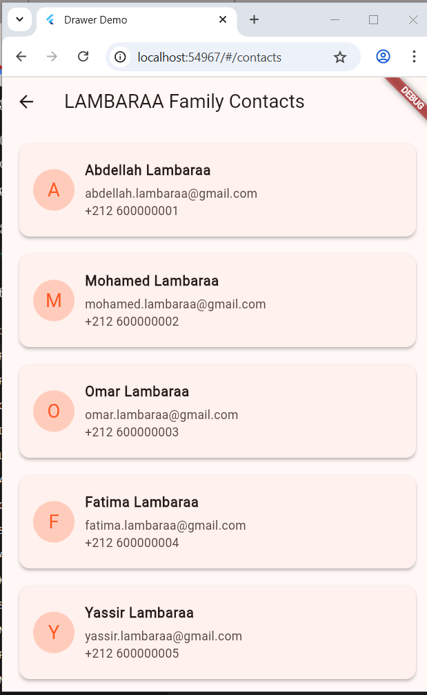
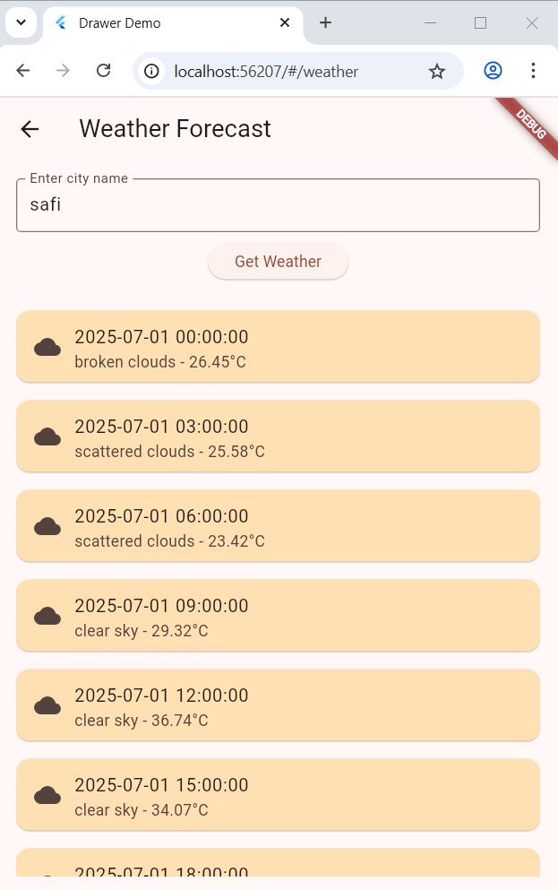
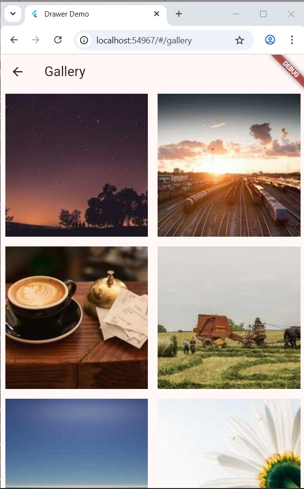
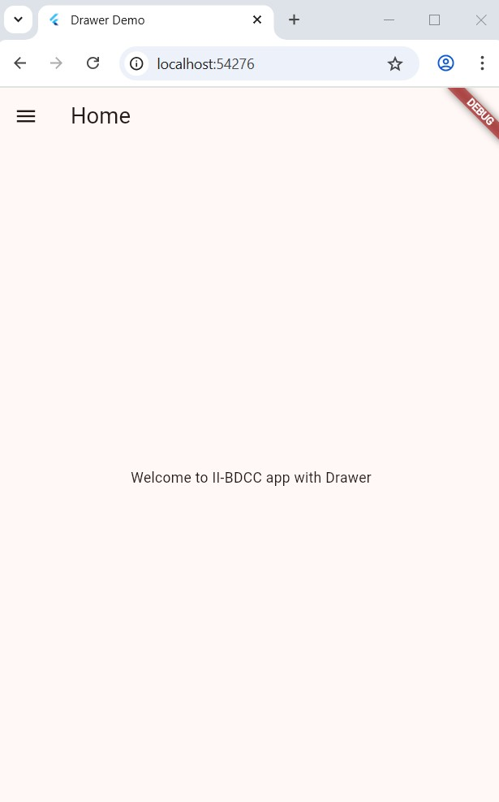

# 🧭 Flutter Drawer Demo App – II-BDCC

Ce projet Flutter présente une application modulaire avec un menu **Drawer** élégant et fonctionnel. Chaque module est indépendant et montre un aspect clé d’une app Flutter moderne.

---

## 📁 Modules inclus

### 📌 1. **Drawer personnalisé**
- Affiche la photo de profil (📷 intégrée avec Asset)
- Navigation vers toutes les pages
- Composants modulaires :
  - `drawer.header.widget.dart`
  - `drawer.item.widget.dart`
  - `mydrawer.widget.dart`


---

### 🧑‍🤝‍🧑 2. **ContactsPage (Famille Lambaraa)**
- Liste des membres de la famille
- Design avec cartes, avatars et séparation claire



---

### ➕➖ 3. **CounterPage**
- Compteur simple avec boutons flottants
- Design épuré et responsive


---

### 🌦️ 4. **WeatherPage**
- Recherche météo par ville (via API OpenWeatherMap)
- Résultats filtrés (8 prévisions)
- Données extraites via `.env`



---

### 🖼️ 5. **GalleryPage**
- Affiche une grille d’images
- Utilisation de `GridView.count`



---

### 🏠 6. **HomePage**
- Page d’accueil simple avec texte de bienvenue
- Accessible via le Drawer



---

## 🔐 Sécurité & Configuration

- API Key stockée dans `.env`
- Chargée via `flutter_dotenv`
- Ajoutée dans `pubspec.yaml` :

```yaml
assets:
  - .env
  - images/profile.jpeg
```

---

## ✅ Lancer l'application

```bash
flutter clean
flutter pub get
flutter run -d chrome
```

> ⚠️ L'image de profil se trouve dans `images/profile.jpeg` et est utilisée dans `DrawerHeader`.

---

## 👨‍💻 Auteur

**Abdellah Lambaraa**  
II-BDCC Flutter Project  
© 2025